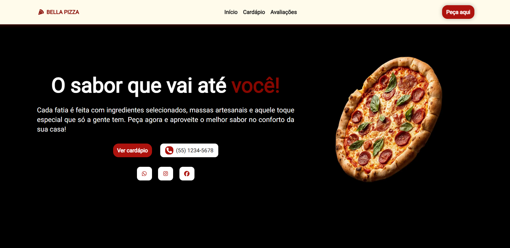
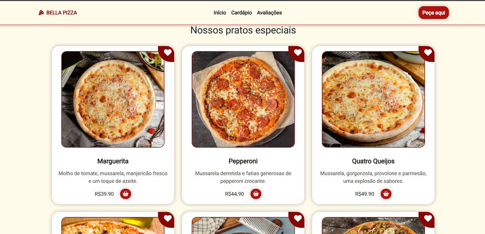
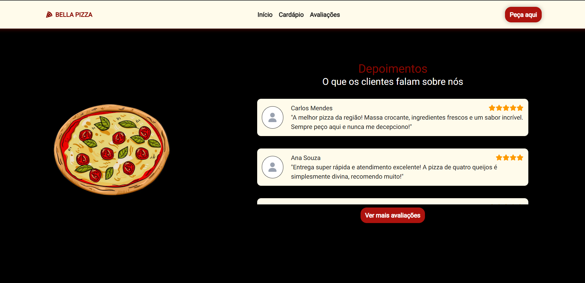

# 🍕 Pizzaria - Landing Page

Esta é uma landing page fictícia para uma pizzaria, desenvolvida para praticar e aprimorar habilidades com **Next.js** e **Tailwind CSS**. O objetivo do projeto é fornecer uma interface responsiva e moderna para apresentação do cardápio e avaliações de clientes.

<div align="center">
  
  
  
</div>

🔗 Acesse o projeto online: Link do Projeto (https://pizzaria-landing-page-alpha.vercel.app)

## 🚀 Tecnologias Utilizadas

### **Frontend**

- **Next.js** - Framework para React, proporcionando melhor desempenho e SEO.
- **React.js** - Biblioteca JavaScript para criação de interfaces de usuário.
- **Tailwind CSS** - Framework CSS para estilização responsiva e customizável.
- **FontAwesome** - Biblioteca de ícones para compor a identidade visual do projeto.
- **JavaScript** - Linguagem principal para a implementação de funcionalidades interativas.
- **JSON** - Utilizado para armazenar os dados do cardápio e depoimentos.

## 📌 Funcionalidades Principais

### Tela Inicial:

- **Título chamativo**: "O sabor que vai até você!"
- **Botões de navegação**: Acesso rápido ao cardápio ou ligação para pedidos.
- **Imagem do produto**: Foto de destaque da pizza.

### Menu (Cardápio):

- Exibe uma lista de produtos (pizzas) com nome, preço, imagem e descrição, a partir de um arquivo `produtos.json`.

### Avaliações de Clientes:

- Exibe depoimentos de clientes fictícios.
- Botão "Ver mais avaliações" para carregar mais depoimentos utilizando interatividade com JavaScript.

### Navegação e Interface:

- **Navegação**: Fácil navegação entre as seções.
- **Responsividade**: A página é totalmente responsiva.
- **Footer**: Contém informações de copyright e links para redes sociais.

## 🧠 Organização do Código

Estrutura de pastas e arquivos da aplicação:

```
📁 public
├─ 📁 images                  # Imagens utilizadas no projeto
📁 src
├─ 📁 app                     # Páginas da aplicação
├─ 📁 components              # Componentes reutilizáveis
│  ├─ Avaliations.jsx         # Seção com as avaliações dos clientes
│  ├─ Button.jsx              # Botão reutilizável estilizado
│  ├─ Clients.jsx             # Componente de avaliação individual (nome, estrelas, comentário)
│  ├─ Footer.jsx              # Rodapé com informações e redes sociais
│  ├─ Menu.jsx                # Lista os produtos (cardápio da pizzaria)
│  ├─ NavBar.jsx              # Navegação principal do site
│  ├─ Product.jsx             # Card individual de um produto (pizza)
│  ├─ SocialButton.jsx        # Botões estilizados para redes sociais
│  └─ Welcome.jsx             # Seção de boas-vindas com chamada principal (hero)
├─ 📁 data                    # Dados simulados em JSON
│  ├─ clientes.json           # Lista de avaliações de clientes (nome, texto, estrelas)
│  └─ produtos.json           # Lista de produtos (pizzas) com nome, imagem, descrição e preço
```

## 🛠️ Como Rodar o Projeto

1. Clone este repositório:

   ```sh
   git clone https://github.com/islaianeribeiro/pizzaria-landing-page.git
   ```

2. Acesse a pasta do projeto:

   ```sh
   cd pizzaria-landing-page
   ```

3. Instale as dependências:

   ```sh
   npm install
   ```

4. Inicie o servidor de desenvolvimento:

   ```sh
   npm run dev
   ```

5. Acesse o projeto no navegador em `http://localhost:3000`

## 🛠 Melhorias Futuras

- [ ] Integração com API para pedidos online
- [ ] Adicionar animações e transições suaves
- [ ] Implementar um backend para gerenciar pedidos e avaliações

---

## Conclusão

Este projeto foi desenvolvido com o intuito de aprimorar minhas habilidades em **Next.js, React e Tailwind CSS**, criando uma landing page responsiva e moderna. A **Pizzaria - Landing Page** proporciona uma experiência interativa, simulando um site real de pizzaria, onde os clientes podem visualizar o cardápio e conferir avaliações.

No futuro, pretendo expandir essa aplicação com novas funcionalidades, como um sistema de pedidos online e integração com APIs externas para melhorar a dinâmica do site.

Se tiver alguma sugestão ou feedback, fique à vontade para contribuir! 😊

## 👩‍💻 Desenvolvido por

**Islaiane Ribeiro**
Front-End Developer

🔗 [https://www.linkedin.com/in/islaianeribeiro](https://www.linkedin.com/in/islaianeribeiro)

---

## 📝 Licença

MIT © 2025 — Sinta-se à vontade para usar como base para seus próprios projetos!
